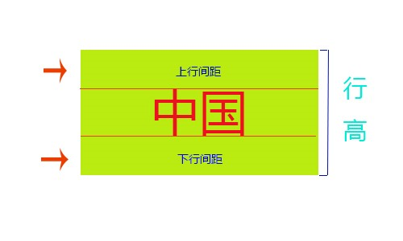
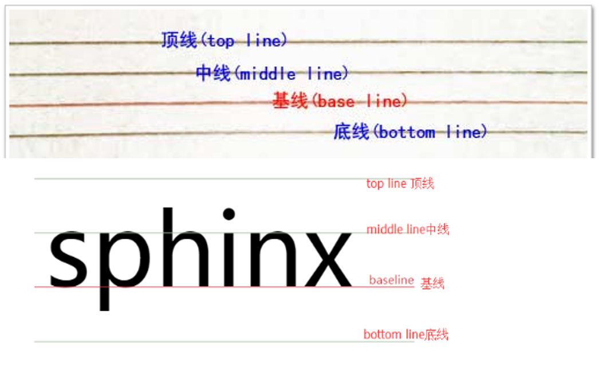

## CSS引入方式

### 内部样式

```css
<style type="text/css">
	css语句
</style>
```

:::tip

type="text/css"可以省略

:::

### 外部样式

创建外部样式表-css文件；    文件中不能有style标签的

#### link方式引入

```html
 <link rel="stylesheet" type="text/css" href="目标文件的路径及文件名全称" />
```

:::tip

1. rel和href这两个属性不能省，不能出错
         rel：规定当前文档(html)与被链接文档(css)之间的关系；
         type：定义文档类型；
         href：规定链接文档的url
2. 使用link元素导入外部样式表时，需将该元素写在文档头部，即<head>与</head>之间

:::

#### import方式引入

```html
<style type="text/css">
    @import  url("目标文件的路径及文件名全称");
</style>
```

:::tip

@和import之间没有空格 url和小括号之间也没有空格；括号内部加引号，必须结尾以分号结束；

:::

#### link @import区别

1. 差别1：
   1. link属于XHTML标签，而@import完全是CSS提供的一种方式。 
   2. link标签除了可以加载CSS外，还可以做很多其它的事情，比如定义RSS，定义rel连接属性等
   3. @import就只能加载CSS。
2. 差别2：加载顺序的差别：
   1. 当一个页面被加载的时候（就是被浏览者浏览的时候），link引用的CSS会同时被加载，
   2. 而@import引用的CSS会等到页面全部被下载完再被加载。所以有时候浏览@import加载CSS的页面时开始会没有样式。
3. 差别3：兼容性的差别：
   1. @import是CSS2.1提出的，所以老的浏览器不支持
   2. @import只在IE5以上的才能识别，而link标签无此问题。
4. 差别4：使用dom控制样式时的差别：
   1. 当使用javascript控制dom去改变样式的时候，只能使用link标签，
   2. 因为@import不是dom可以控制的.

### 内联样式

```html
<标签 style="属性1:值1;属性2:值2; ……"></标签>
```

## CSS样式表的权重关系

1. `内联样式表`的`优先级别最高`
2. `内部样式表`与`外部样式表`的优先级`和书写的顺序有关`，`后书写的优先级别高`。
3. `同在一个样式表中的优先级`和书写的顺序也有关，`后书写的优先级别高`。(`被覆盖的只是相同属性的样式`)

## CSS选择符分类

### 类型选择符（标记选择器、元素选择符）

```css
body{
    color: '#fff'
}
```

###     类选择符 （class选择符）

.class名{属性：属性值;}

1. 一个标记可以设置多个class名
2. class名可以重复，后面优先级高，如果重复，后面覆盖前面

```html
html：<div class="fontColor fontSize"></div>
```

```css
.colorStyle: {
    color: '#fff';
}
.fontSize: {
    font-size: 16px;
}
.fontSize: {
    width: 100px;
}
```

###     ID选择符 （id选择器）

一个id名称只能`在文档中出现一次`，因为id是唯一的

```html
<div id="top"></div>
```

```css
#box{width:300px; height:300px;}
```

###     伪类选择器

a:link {color: red;}                    /* 未访问的链接状态 */
a:visited {color: green;}				/* 已访问的链接状态 */
a:hover {color: blue;}                  /* 鼠标滑过链接状态 */
a:active {color: yellow;}               /* 鼠标按下去时的状态 */
a:focus{color: gray}                     /*元素获得鼠标焦点时的状态*/

> 当这4个超链接伪类选择符联合使用时，应注意他们的顺序，正常顺序为：
> a，a:link,a:visited,a:hover,a:active,错误的顺序有时会使超链接的样式失效；

###     群组选择符（集合选择器）

```txt
语法：选择符1，……，选择符5 {属性：属性值;}

说明：当有多个选择符应用相同的样式时，可以将选择符用“，”分隔的方式，合并为一组。
     实例：.top, #nav, p{width:100px;}
```

###     包含选择符（后代选择器）

```txt
语法：选择符1(父)  选择符2（后代）{属性：属性值;} 
     选择符父级  选择符子级{属性：属性值;}

说明：选择符1和选择符2用空格隔开，含义就是选择符1中包含的所有选择符2;
	实例： div   ul  li{height:200px;}
```

###     子选择符

```txt
语法：选择符1(父)  > 选择符2(子){属性：属性值;}

说明：
选择符1和选择符2用>链接，选择符2必须是选择符1的子类
```

###     通配符（*）

```txt
语法：*{属性：属性值;}

说明：通配选择符的写法是“*”，其含义就是所有标签；    
		表示该样式适用所有网页元素；

用法：常用来重置样式。
例：*{margin:0;padding:0;}
```

###     属性选择符

###     伪对象选择符

## 选择符权重

1. 标签选择器（如div）的权重为0；
2. class选择器（如.example）的权重为10；
3. id选择器（如#example）的权重为100；
4. 内联样式（直接写在HTML标签上的style属性）的权重最高，为1000。

## 背景属性

### background-color：设置元素的背景颜色。

属性值：colorname：规定颜色名称为背景
    hex：规定十六进制的背景颜色
    rgb：规定rgb的背景颜色
    transparent：默认，背景颜色为透明

### background-image：为元素设置背景图像。

####    属性值：

1. url（）：指向图像路径
2. none：默认值，不显示背景图像

####    背景图片的显示原则：

​    1）容器尺寸等于图片尺寸，背景图片正好显示在容器中;

​    2）容器尺寸大于图片尺寸，背景图片将默认平铺，直至铺满元素；

​    3）容器尺寸小于图片尺寸，只显示元素范围以内的背景图。

    网页上有两种图片形式：插入图片、背景图；
    *插入图片：*属于网页内容，也就是结构。
    *背景图：*属于网页的表现，背景图上可以显示文字、插入图片、表格等。

### background-repeat：设置是否及如何重复背景图像。

#### 属性值：

1. no-repeat：背景图像仅显示一次，不平铺
2. repeat：默认。背景图像将在垂直方向和水平方向重复
3. repeat-x：背景图像将在水平方向重复。
4. repeat-y：背景图像将在垂直方向重复。

### background-position：属性设置背景图像的起始位置。 

#### 属性值：

1. xpos(像素）/%（按照当前的div的宽、高的值的百分比显示）/ left right center

2. 给百分比，更多的是给位置，比如只给10%那么算的是像素，但是50% 50%就是居中，100%  100%就是局下

3.  ypos/%/ top bottom center

   :::tip

   第一个值是水平位置，第二个值是垂直位置。
   如果仅规定了一个值，另一个值将是50%/center

   :::

### background-attachment：设置背景图像是否固定或者随着页面的其余部分滚动。

#### 属性值：

1. scroll:默认值。背景图像会随着页面其余部分的滚动而移动。
2. fixed：当页面的其余部分滚动时，背景图像不会移动。

background：简写属性，在一个声明中设置所有的背景属性
	注意要有背景图的情况下，才能写背景图的定位和平铺
background:color image repeat position attachment
background:image repeat position attachment color
background:image repeat attachment position color
background:image;其他的属性值不写，但是有默认值；

## 单位

### 相对单位

#### css2

%	   百分比
em	   1em等于当前元素的字体尺寸。2em等于当前字体尺寸的两倍。
px
ex	   一个ex是一个字体的x-height。(x-height通常是字体尺寸的一半。)
ch	   数字0的宽度

#### css3

vw	   viewpoint width，视窗宽度，1vw=视窗宽度的1%
vh	   viewpoint height，视窗高度，1vh=视窗高度的1%
vmin   vw和vh中较小的那个。
vmax   vw和vh中较大的那个。
rem	   rem是根em（root em）的缩写，rem作用于非根元素时，相对于根元素字体大小；rem作用于根元素字体大小时，相对于其出初始字体大小。

### 绝对单位

pt	磅 (1pt等于1/72英寸) 9pt=12px
pc	12 点活字 (1pc等于12点)
in	英寸
cm	厘米
mm	毫米
px	像素 (计算机屏幕上的一个点)

## 文本属性

### font-size：可设置字体的尺寸说明：

1. 1值为数值型时，必须给属性值加单位，属性值为0时除外。
2. 为了减小系统间的字体显示差异，IE Netscape Mozilla的浏览器制作商于1999年召开会议，共同确定16px/ppi为标准字体大小默认值,即1em.默认情况下，1em=16px, 0.75em=12px; 
3. 使用绝对大小关键字
   1. ​      xx-small =9px
   2. ​      x-small =11px
   3. ​      small =13px
   4. ​      medium =16px
   5. ​      large =19px
   6. ​      x-large =23px
   7. ​      xx-large =27px

### color：规定文本的颜色。

属性值：

1. colorname
2. hex
3. rgb 

### font-family：规定元素的字体系列

(1)此属性设置几个字体名称作为一种"后备"机制，如果浏览器不支持第一种字体，将尝试下一种字体，都不支持按系统默认字体显示。
(2) 如果字体系列的名称超过一个字，它必须用引号，如Font Family："宋体""Times New Roman"
(3) 多个字体系列是用一个逗号分隔指明;

### font-weight：设置显示元素的文本中所用的字体加粗

属性值： 

1. 单词

   1. bolder 更粗的
   2. bold 加粗
   3. normal 常规
   4. lighter 更细

2. 数字

   1. 100—900 100对应最轻的字体变形
   2.  900对应最重的字体变形，
   3. 100-400 一般显示 
   4. 500常规字体 
   5. 600-900加粗字体

   :::tip

   上述含有区间的数字，不管选哪个数字，效果一样， 不会有渐渐变粗这样的效果

   :::

### font-style：设置文本倾斜

属性值：

1. italic   倾斜 
2. oblique  更倾斜
3. normal   取消倾斜，常规显示

:::tip

1.  b、strong自带加粗
2.  i、em自带倾斜
3.  h标签带有加粗和文本大小设置的

:::

### line-height： 属性设置行间的距离(行高)

1. 设置这行高度，如果文字大小达不到这个高度，文字默认垂直居中
2. 如果将单行文本的line-height设置和盒子的高度一样的大小，那么这样就可以实现单行文本在标签中垂直居中显示
3. 针对多行文本，可以设置行与行之间的间距

属性值：

1. normal	默认。设置合理的行间距。

2. number	设置数字，此数字会与当前的字体尺寸相乘来设置行间距(em)。

3. length	设置固定的行间距。

4. %	基于当前字体尺寸的百分比行间距。

   

   A:行高指的是文本行的基线间的距离，而基线（Base line），指的是一行字横排时下沿的基础线，基线并不是汉字的下端沿，而是英文字母x的下端沿

   B:行高有一个特性，叫做垂直居中性（文本在行高垂直居中的位置显示）

:::tip 说明

1.  当单行文本的行高等于容器高时，可实现单行文本在容器中垂直方向居中对齐(重要)；
2.  当单行文本的行高小于容器高时，可实现单行文本在容器中垂直中间以上显示；
3.  当单行文本的行高大于容器高时，可实现单行文本在容器中垂直中间以下（IE6及以下版本存在浏览器兼容问题）

:::






### font:文字属性简写

一般只设置文本大小/行高 +  字体
font:font-style | font-variant(小体大写字母) | font-weight | font-size / line-height | font-family

1. 简写时 , font-size和line-height只能通过斜杠/组成一个值，不能分开写。
2. 顺序不能改变 ,这种简写法只有在同时指定font-size和font-family属性时才起作用,而且,你没有设定font-weight , font-style , 以及font-varient , 他们会使用缺省值(normal)。
3. font:font-size/line-height  font-family

### text-align：设置文本水平对齐方式   

属性值：

1. left	把文本排列到左边。默认值：由浏览器决定。
2. right	把文本排列到右边。
3. center	把文本排列到中间。
4. justify	实现两端对齐文本效果。

### text-decoration：规定添加到文本的修饰

属性值：

1. none:没有修饰
2. underline:添加下划线
3. overline:添加上划线
4. line-through:添加删除线

### text-indent：属性规定文本块中首行文本的缩进（属性值可以为负值）

1. 正值：从原点向右移动
2. 负值：从原点向左移动

属性值： 

1. length	定义固定的缩进。默认值：0。
2. %	定义基于父元素宽度的百分比的缩进。 

:::tip

以上10个要记住

:::

### text-transform：设置文本大小写

属性值：

1. none	默认。定义带有小写字母和大写字母的标准的文本。
2. capitalize	文本中的每个单词以大写字母开头。
3. uppercase	定义仅有大写字母。
4. lowercase	定义无大写字母，仅有小写字母。

### letter-spacing：属性增加或减少字符间的空白（字符间距）。

​	每一个汉字、每一个单个都字母都是字符
属性值：

1. normal	默认。规定字符间没有额外的空间。
2. length	定义字符间的固定空间（允许使用负值）。

### word-spacing：属性增加或减少单词间的空白（即字间隔）。

属性值：

1. normal	默认。定义单词间的标准空间。
2. length	定义单词间的固定空间。	


