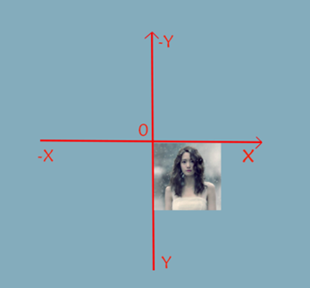

## 文档流

- CSS 有三种基本的定位机制：**普通流、浮动流、定位流**。

## 语法介绍

绝对定位的`宽度和高度设置百分比`时，宽度`参照的是包含块的大小`，`不再是父元素的大小`

### position 属性值

#### static

`默认值`。静态定位，元素出现在正常的流中，没有特殊的位置改变，元素的位置根据在html中的书写顺序依次排序显示

#### relative

根据标签在浏览器中的默认位置进行定位（`相对自己原来的位置定位`）
	一般结合left（距左边位置大小） right top bottom 属性 使用，
		值可正可负，可以px，可以%

示例代码：

```css
div{
    position：relative
    left：10px;
    right:10px;
}
```

:::tip

相对定位不会让元素脱离正常文档流
生成相对定位的元素，相对于其正常位置进行定位。
说明：元素仍然保持其未定位前的形状，它原本在文本流中所占的空间仍保留

::: 

#### absolute

生成绝对定位的元素，**相对于static定位以外的`第一个父元素`进行定位**。

`相对定位不会对文档流产生影响`，同样`使用left等属性`，只不过不同的`是相对于包含块的位置而已`
**如果都没有父元素设置定位，那么最终是根据窗口进行定位的**
**绝对定位会使元素脱离正常文档流**

:::tip 层叠顺序

1. 加了定位设置的元素比没有加定位设置的元素层叠顺序高
2. 两个都加了定位设置，看书写顺序，后书写的比较高

::: 

:::tip 设置层叠顺序

1. z-index:auto(可以理解成0)
2. 可以写数字（不要+px）可以为正，可以为负，正数上浮，负数下沉(一般不建议负值，因为会低到父元素下面，如果要改变位置，可以通过正值不同的大小来设置)   

:::

#### fixed

生成固定定位的元素，相对于浏览器窗口进行定位。
	同样使用left、right、top、bottom进行位置设置
	使`元素脱离正常文档流`

:::tip 说明

​	:airplane:

1. 给元素设置固定定位之后，元素原先在正常文档流中所占的空间会关闭，就好像该元素原来不存在一样

​	:rocket:

1. 绝对定位元素会根据有定位设置（除static定位）的父元素作为参照进行定位；
2. 如果父元素没有定位设置，那就继续向上找祖父元素，看是否有定位设置，有的话就根据祖父元素定位，
3. 没有的话，那就继续向上找…….
4. 如果都没有，就根据窗口进行定位。

:::

包含块：绝对定位元素参照的有定位设置的父元素我们称为包含块，包含块是绝对定位的基础，包含块就是为绝对定位元素提供坐标偏移和显示范围的参照物；

设置某个元素为包含块：给此元素添加relative，fixed，absolute都可以，推荐使用relative，因为不会影响元素在文本流中的显示；

#### sticky

（css3中新增的属性值）: 粘性定位，该定位基于用户滚动的位置。
    说明：元素在浏览器范围内定位时就像 position:relative; 空间会被保留
	而当页面滚动的距离超出设置的距离时，它的定位效果就像 position:fixed，它会固定在目标位置

定位需要配合使用的属性：以下属性用于给元素定位设置坐标点的位置；
 left   属性规定元素的左边缘偏移的大小。
 right  属性规定元素的右边缘偏移的大小。
 top    属性规定元素的顶部边缘偏移的大小。
 bottom 属性规定元素的底部边缘偏移的大小。
     属性值：
       auto：  默认值。通过浏览器计算左边缘的位置。
       %：     设置以包含元素的百分比计的左边位置。可使用负值。
       length：使用 px、cm 等单位设置元素的左边位置。可使用负值。 

## 编程中的坐标

​     编程中的坐标：x轴-水平轴 右为正 左为负，Y轴-垂直轴 下为正 上为负


每个元素都自带一个坐标系，元素左上角的位置为原点（0 , 0）位置，如下图所示



## 定位之间的区别

1. absolute：绝对定位

   1. 元素根据离其最近的并且有定位设置(不能是static)的父元素进行位置的偏移
   2. 绝对定位会使元素脱离正常文档流
2. relative：相对定位
   1. 元素会相对于它在正常流中的默认位置偏移。
   2. 相对定位不会使元素脱离正常文档流
3. fixed：固定定位
   1. 根据浏览器的可视界面进行位置的偏移
   2. 固定定位会使元素脱离正常文档流

## 定位对元素类型的影响

元素设置绝对定位、固定定位后，会生成一个块级框，而不论原来它在正常流中生成何种类型的框。

**浮动（float）、绝对定位和固定定位，都会生成块状元素，不管之前是什么类型**

## 层叠关系

z-index : 属性设置元素的堆叠顺序，拥有更高堆叠顺序的元素总是会处于堆叠顺序较低的元素的前面。
 属性值：

1. auto：默认值。
2. number:无单位的整数值。可为负数

​	大：越叠越大

​	小：越叠越低

​	可正可负

​	必须结合定位属性（不能是默认值）使用才能有效

:::tip 说明

1. 此属性仅仅作用于position属性值为relative或absolute,fixed的对象。没有定位无法使用
2. 该属性设置一个定位元素沿z轴的位置，z轴定义为垂直延伸到显示区的轴，如果为正数，则离用户更近，为负数则表示离用户更远。

:::

## 总结

position

​	static

​	relative：根据自身，不脱离文档流

​	absolute：根据包含块，脱离文档流

​		变为包含块：设置定位属性，属性值不能是默认值，推荐relative

​	fixed:窗口脱离文档流

## xx

```
（三）
让一个元素显示在窗口水平、垂直位置居中：
    1、div{width:200px;height:200px;background:#f00;position:fixed;left:0;right:0;top:0;bottom:0;margin:auto;}
2、
div{width:200px;height:200px;background:#f00;position:fixed;left:50%;top:50%;margin:-100px 0 0 -100px;}


让一个元素显示在父元素水平、垂直位置居中：
	只需要讲上面的固定定位改成绝对定位就好了
	父元素relative，子元素absolute
```

transition过渡

​	过渡;元素的属性值从当前值变成另外一个值是用   n秒   的时间完成这个改变

transition：属性值   2s ， 属性值2   10s； transition：all  3s；对所有的改变都是3s

​	放到元素css样式中

过渡

​	transition：需要过渡效果的属性名 过渡效果的时长


​	


