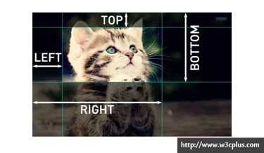

## 定义：

是网页制作中超级链接的一种，又叫命名锚记。命名锚记像一个迅速定位器一样是一种页面内的超级链接，运用相当普遍。

## 命名锚点链接

命名锚点的作用：在`同一页面`或者`不同页面`的，不同位置进行跳转。

给元素定义命名锚记名
语法：`<标记 id="命名锚记名"></标记> `

命名锚记连接
语法：`<a href="#锚记名称"></a>`

### 代码示例

1. 跳转到同页面的其他位置

   ```html
   <a href="#section"></a>//用来点击
   
   <div id="section">//用来定位到相应的位置</div>
   ```

2. 跳转到不同页面的位置

   `<a href="跳转页面的URL+所想跳转到区域的ID(或者说锚点名称)"></a>`

   ```html
   如：
   <a href="#section"></a>//用来点击
   
   <div id="01.html#section">//用来定位到相应的位置</div>
   ```

## clip属性

clip：检索或设置对象的可视区域，区域外的部分是透明的，
	注意：必须将position的值设为absolute，fixed，此属性方可使用。

 属性值：

1. ​    shape：设置元素的形状。唯一合法的形状值是：rect (top,right, bottom,left)
2. ​    auto：默认值。不应用任何剪裁。
3. inherit：从父元素继承clip属性的值




