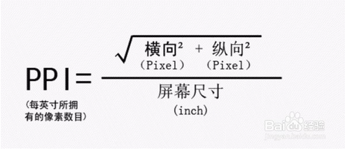
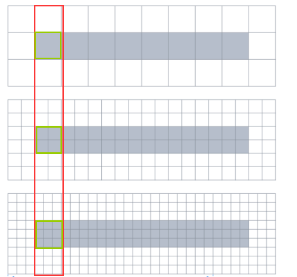

## 视口-viewport

```
许多智能手机都使用了一个比实际屏幕尺寸大很多的虚拟可视区域(980px)，主要目的就是让pc页面在智能手机端阅读时不会因为实际可视区域变形。所以你看到的页面还是普通样式，即一个全局缩小后的页面。为了让智能手机能根据媒体查询匹配对应样式，让页面在智能手机中正常显示，特意添加了一个meta标签。这个标签的主要作用就是让智能手机浏览页面时能进行优化，并且可以自定义界面可视区域的尺寸和缩放级别。

语法：
<meta name="viewport"  content="width=device-width, initial-scale=1.0, maximum-scale=1.0, user-scalable=no">
属性值：
    width:可视区域的宽度,值可为数字或关键词device-width；
    height:可视区域的高度,值可为数字或关键词device-height；
    initial-scale:页面首次被显示时的缩放级别（0-10.0），取值为1时页面按实际尺寸显示，无任何缩放
    			当设置0~1之间数值，不是将元素缩小，而是让视口放大
    minimum-scale:设定最小缩小比例（0-10.0），取值为1时将禁止用户缩小至实际尺寸之下
    maximum-scale:设定最大放大比例（0-10.0），取值为1时将禁止用户放大至实际尺寸之上
    user-scalable:设定用户是否可以缩放（yes/no）

含义为：宽为手机移动设备默认宽度，初始缩放比例为1.0，最大缩放比例为原始像素大小，不允许用户放大或者缩小;

```

## CSS3单位

```
相对单位：
CSS2：
em：表示相对于应用在当前元素的字体尺寸；
ex: 表示英文字母小x的高度
ch: 数字0的宽度	

CSS3：
rem: 相对于根元素（html）的font-size
vw: viewpoint width，视窗宽度，1vw=视窗宽度的1%
vh: viewpoint height，视窗高度，1vh=视窗高度的1%
vmin: vw和vh中较小的那个。	
vmax: vw和vh中较大的那个。
px: 编程中使用的开发单位；

绝对单位：cm mm in pt pc px

对于使用过vm或者vh进行适配字体，有时候手机屏幕过小，换算的字体低于12px后影响体验，这时可以使用媒体查询来进行字体更改
```

#### 分辨率，PPi,DPI,DPR,物理像素，逻辑像素区别

```txt
1、屏幕尺寸：指的是屏幕对角线的长度(1英寸 = 2.54 厘米)

2、分辨率：是指宽度上和高度上最多能显示的物理像素点个数

3、点距：像素与像素之间的距离，点距和屏幕尺寸决定了分辨率大小

4、PPI:屏幕像素密度，即每英寸(1英寸=2.54厘米)聚集的像素点个数，这里的一英寸还是对角线长度；
   手机屏幕距离你的眼睛10-12英寸(约25-30厘米)时,它的分辨率只要达到300PPI这个神奇数字(每英寸300个像素点)以上,你的视网膜就无法分辨出像素点了,这样的屏幕被称为“视网膜屏幕”-Retina
   PPI越高，像素越高，屏幕越清晰

5、DPI:每英寸像素点，印刷行业术语。对于电脑屏幕而言和PPI是一个意思

6、设备像素(又称为物理像素): 指设备能控制显示的最小物理单位，意指显示器上一个个的点。

7、设备独立像素(也叫密度无关像素或逻辑像素)：可以认为是计算机坐标系统中得一个点，这个点代表一个可以由程序使用的虚拟像素(比如: css像素)，这个点是没有固定大小的，然后由相关系统转换为物理像素。

8、DPR(设备像素比)：设备像素比 = 设备像素 / 逻辑像素。(在Retina屏的iphone上，DPR为2，1个css像素相当于2个物理像素)
     window.devicePixelRatio 
```







## 其他设置

```
忽略Android平台中对邮箱地址的识别
<meta name="format-detection" content="email=no" />

iPhone会将看起来像电话号码的数字添加电话连接，应当关闭(可选yes no)
<meta name="format-detection" content="telephone=no" />

当网站添加到主屏幕快速启动方式，可隐藏地址栏，仅针对ios的safari
<meta name="apple-mobile-web-app-capable" content="yes" />

在web app应用下状态条（屏幕顶部条）的颜色；
<meta name="apple-mobile-web-app-status-bar-style" content="black" />
  默认值：default（白色）
         black（黑色）
         black-translucent（灰色半透明）。

网站开启对web app程序的支持
<meta name="apple-mobile-web-app-capable" content="yes" />

添加到主屏幕后，全屏显示 
<meta name="apple-touch-fullscreen" content="yes">

就是删除默认的苹果工具栏和菜单栏
<meta name="apple-mobile-web-app-capable" content="yes" />
content有两个值”yes”和”no”,当需要显示工具栏和菜单栏时，这个行meta就不用加了，默认就是显示。

应用信息，保留系统历史记录，运动效果
<meta name=”App-Config” content=”fullscreen=yes,useHistoryState=yes,transition=yes”/>

```


## xx

```
1. pt 即 point：有两个含义：

  一是印刷行业常用单位，是一个标准长度单位，绝对大小，1pt = 1/72 英寸 = 0.35mm；

  二是 iOS 开发用的基本单位；


2. dp (也称 dip)

   dp 是安卓开发用的基准单位，在 dpi (屏幕像素密度，即每英寸包含的像素点) 为 160 的屏幕为上，1dp = 1px。为了简单起见，Android 把屏幕密度分为了 5 种：mdpi、hdpi、xhdpi、xxhdpi、xxxhdpi；


3. sp (可缩放独立像素)

   在安卓系统里，sp 与 dp 类似，不同的是 sp 可以根据用户的字体大小首选项进行缩放，而 dp 则不会。 尽量使用 dp 作为空间大小单位，sp 作为文字相关大小单位。
```

