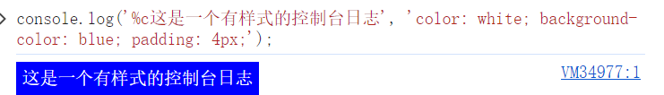

## log

打印文本信息

### 占位符使用

```js
console.log("圆周率整数部分：%d，带上小数是：%f",3.1415,3.1415);
```

### 设置css样式

```js
console.log('%c这是一个有样式的控制台日志', 'color: white; background-color: blue; padding: 4px;');
```



## warn

打印警告

## error

打印错误信息

## group

打印树状结构，配合groupCollapsed以及groupEnd方法

## groupEnd

结束当前Tree

## table

将数据打印成表格