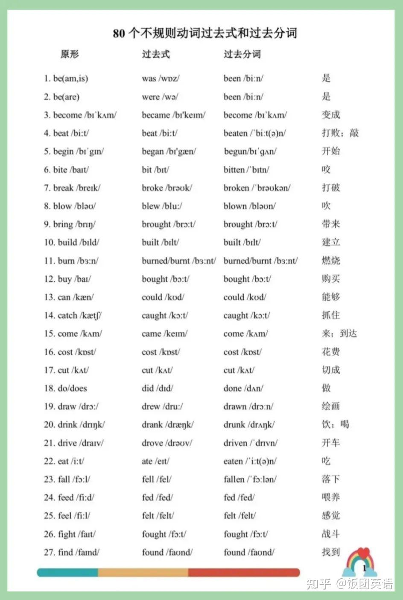
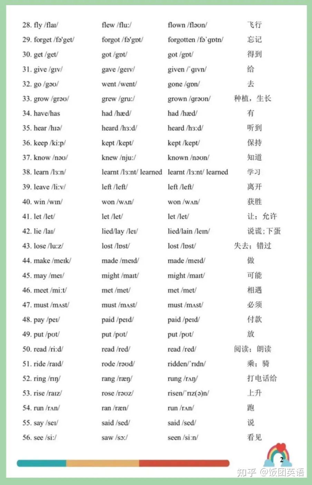
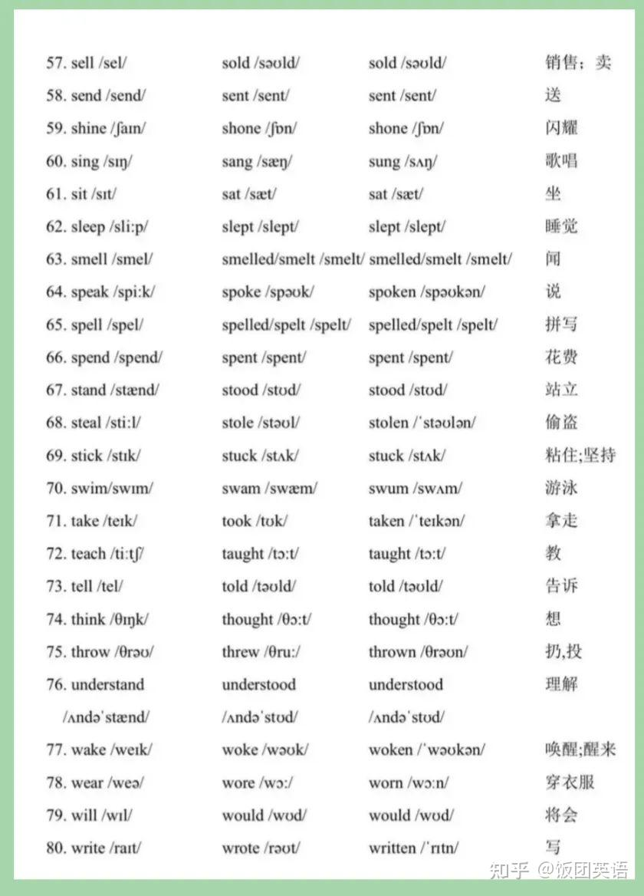

过去式&过去分词列表

## 规则动词变化

1. 一般情况下，动词词尾加 -ed ，如： play--played work --worked wanted--wanted
2. 以不发音的 -e 结尾动词，动词词尾加 -d，如：live--lived move--moved taste--tasted
3. 以辅音字母 + y结尾的动词，把-y变为-i 再加-ed，如：study--studied copy--copied cry--cried
4. 以一个辅音字母结尾的重读闭音节动词，双写词尾辅音字母，再加 -ed，如： stop --stopped admit--admitted prefer--preferred control--controlled

## 不规则动词变化

| 原型 | 过去式 | 过去分词 | 词意 |
| ---- | ------ | -------- | ---- |
|      |        |          |      |
|      |        |          |      |
|      |        |          |      |
|      |        |          |      |
|      |        |          |      |

